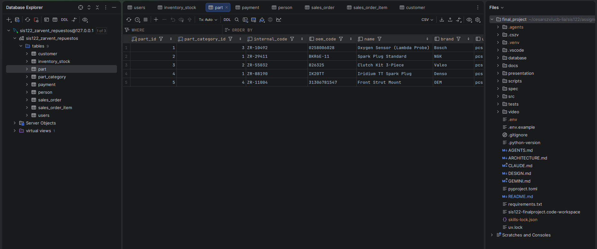
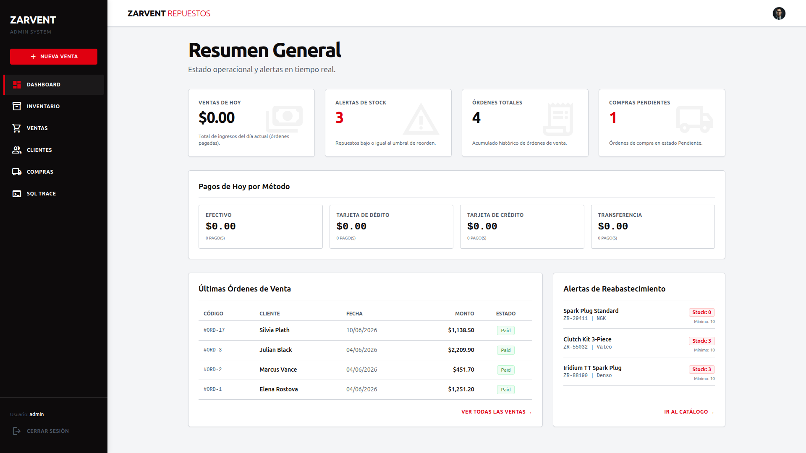
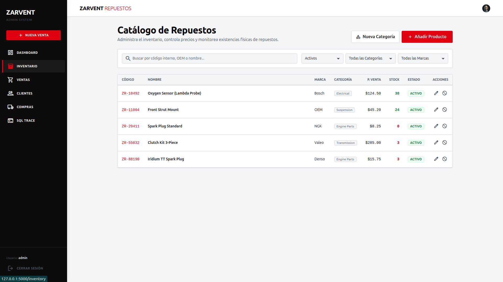
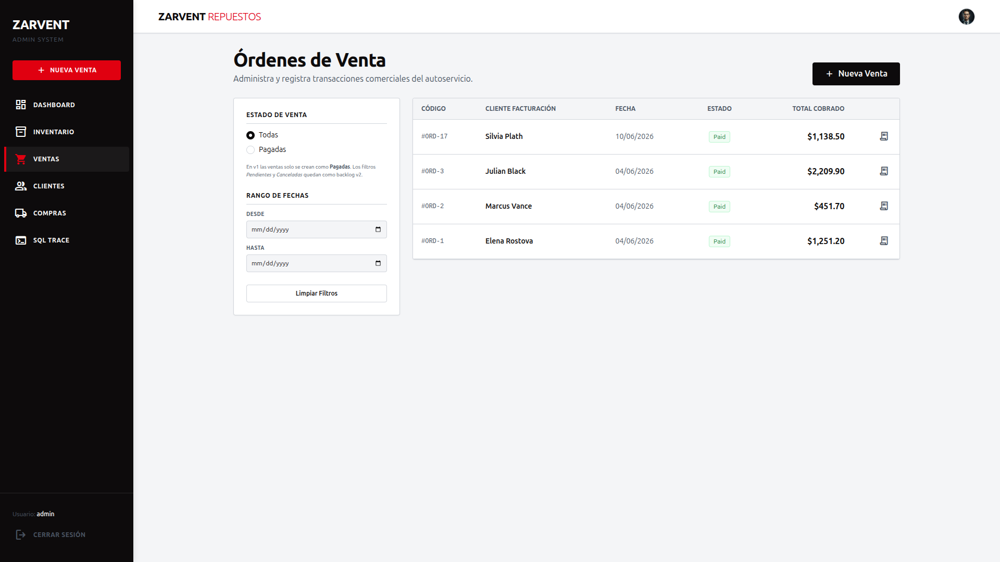
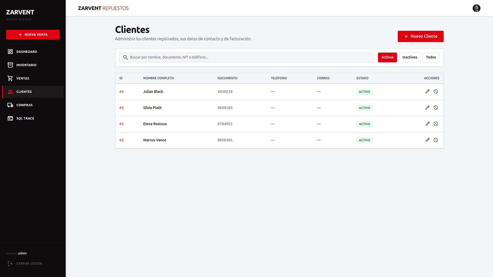
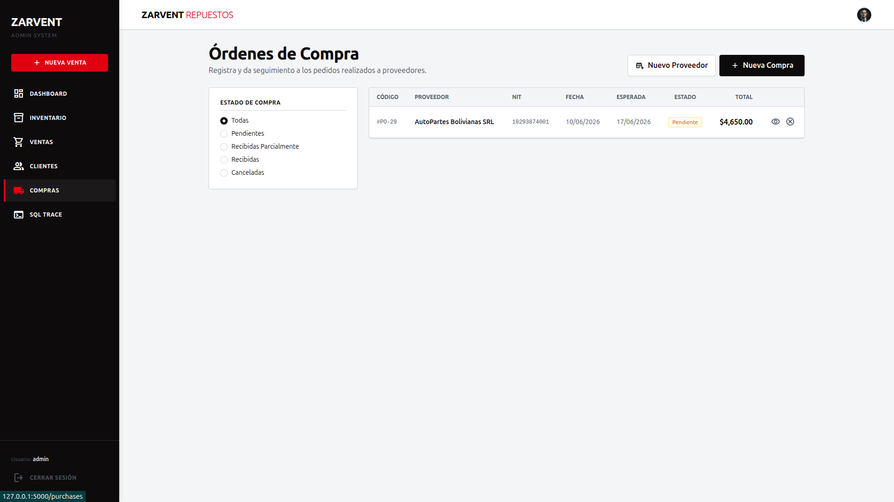
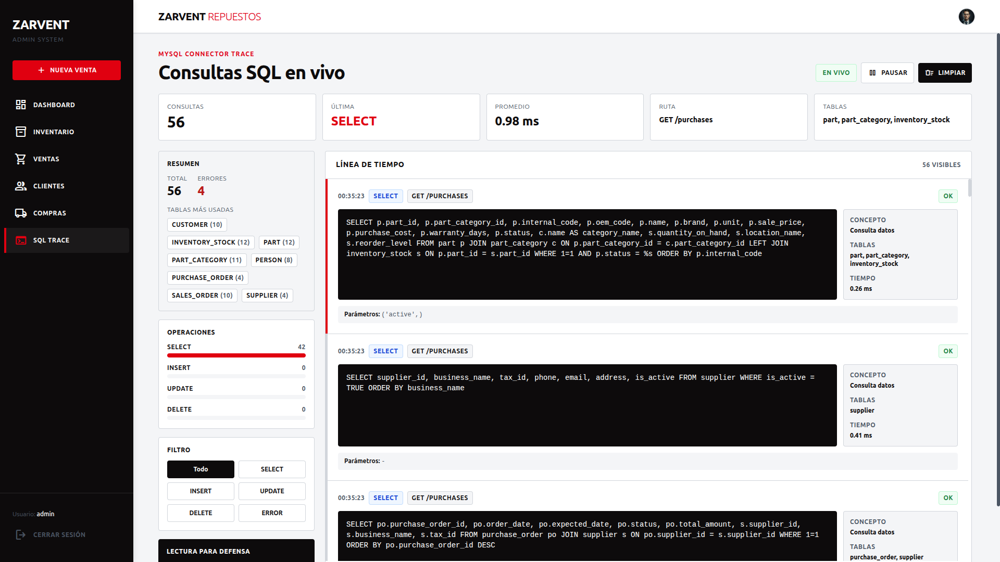

# Zarvent Repuestos

Proyecto academico para la materia `SIS-122` (Base de Datos I), con el
profesor *Ismael Antonio Delgado Huanca*.

Realizado por:

- Cesar Sebastian Zambrana Ventura
















## Introduccion

Zarvent Repuestos es un sistema academico para una empresa ficticia que vende
repuestos de vehiculos.

El proyecto busca demostrar como una base de datos relacional puede ordenar la
informacion principal del negocio: clientes, repuestos, inventario, ventas,
pagos, proveedores, compras y devoluciones.

El objetivo principal no es hacer una aplicacion grande ni una arquitectura
avanzada. El objetivo es entender y defender bien el modelo relacional:
entidades, atributos, claves primarias, claves foraneas, relaciones,
normalizacion y reglas de negocio.

## Antecedentes

### Descripcion actual del sistema

En un negocio pequeno de repuestos, muchas tareas pueden hacerse con papel,
Excel, WhatsApp y memoria del personal.

Ese metodo puede funcionar al inicio, pero se vuelve dificil de controlar
cuando aumentan los clientes, los productos y las ventas. La informacion queda
separada en varios lugares y no siempre se sabe cual dato es el correcto.

En Zarvent Repuestos, el flujo basico del negocio es:

1. El cliente consulta por un repuesto.
2. El vendedor identifica el vehiculo, la pieza o el codigo.
3. Se revisa si el repuesto existe en el catalogo.
4. Se valida precio, compatibilidad y stock.
5. Si el cliente compra, se registra la venta.
6. Se registra el pago.
7. El inventario descuenta la cantidad vendida.
8. Si el stock queda bajo, se planifica una compra al proveedor.
9. Si hay devolucion o garantia, se revisa contra la venta original.

El sistema propuesto centraliza esos datos en MySQL Server y los conecta con
una aplicacion web basica hecha en Flask.

## Problema

El problema principal es que los procesos manuales de registro pueden provocar
datos duplicados, errores en ventas y perdida de informacion importante.

Cuando clientes, repuestos, precios, pagos y stock se registran en lugares
separados, el negocio no puede consultar la informacion con confianza.

### Causas

- Los clientes pueden registrarse mas de una vez.
- Los repuestos pueden escribirse con nombres o codigos diferentes.
- El stock puede quedar desactualizado despues de una venta o compra.
- Los pagos pueden quedar separados de la venta original.
- Las devoluciones pueden registrarse sin relacion clara con la venta.
- Los reportes dependen de revisar papeles, planillas o mensajes sueltos.

### Efectos

- Se pueden vender repuestos sin stock suficiente.
- Se puede vender una pieza incompatible con el vehiculo del cliente.
- Se pierde historial de precios y costos.
- Es dificil saber que productos deben reponerse.
- La gerencia no tiene reportes rapidos para tomar decisiones.
- El equipo no puede defender bien la informacion si no hay relaciones claras.

## Objetivos

### Objetivo general

Disenar una base de datos relacional en MySQL Server y una aplicacion web
basica para registrar y consultar informacion operativa de Zarvent Repuestos.

### Objetivos especificos

1. Analizar los actores, procesos, procedimientos y recursos del negocio.
2. Identificar las entidades principales del sistema y sus relaciones.
3. Disenar un diagrama entidad-relacion defendible para Base de Datos I.
4. Traducir el modelo a tablas, claves primarias, claves foraneas y reglas de
   integridad.
5. Implementar un prototipo web conectado a MySQL para mostrar login,
   dashboard, inventario, clientes, ventas, pagos y recibos.
6. Documentar el proyecto con lenguaje simple para que un estudiante junior
   pueda explicarlo desde cero.

## Resultados

### Diagrama entidad-relacion

El proyecto tiene un ERD compacto en:

- [`docs/database/erd.md`](docs/database/erd.md)

El modelo separa conceptos importantes:

- `PERSON` no es lo mismo que `CUSTOMER`.
- `PART` no es lo mismo que `INVENTORY_STOCK`.
- `SALES_ORDER` no es lo mismo que `PAYMENT`.
- `PURCHASE_ORDER` no es lo mismo que `PURCHASE_ORDER_ITEM`.
- `RETURN_ORDER` debe relacionarse con una venta real.
- `PART_COMPATIBILITY` resuelve la compatibilidad entre repuestos y vehiculos.

### Base de datos en MySQL

La base de datos del proyecto se llama:

```text
sis122_zarvent_repuestos
```

El esquema conceptual completo se explica en:

- [`docs/database/db_explanation.md`](docs/database/db_explanation.md)
- [`docs/database/erd_explanation.md`](docs/database/erd_explanation.md)

El borrador manual del esquema SQL esta en:

- [`database/schema.sql`](database/schema.sql)

Ese archivo sirve para estudiar el orden de creacion de tablas y completar el
SQL desde el ERD.

### Codigo SQL y scripts

El repositorio tambien incluye scripts para preparar una base local de
demostracion:

- [`scripts/database/001_create_project_database.sql`](scripts/database/001_create_project_database.sql)
- [`scripts/database/002_create_login_users_table.sql`](scripts/database/002_create_login_users_table.sql)
- [`scripts/database/003_create_mysql_app_users.sql`](scripts/database/003_create_mysql_app_users.sql)
- [`scripts/database/setup_database.py`](scripts/database/setup_database.py)
- [`scripts/database/seed_project_data.py`](scripts/database/seed_project_data.py)

Estos scripts ayudan a crear la base, configurar el usuario de la aplicacion y
cargar datos de prueba.

### Aplicacion web conectada a la base de datos

El prototipo web esta hecho con Flask y se conecta a MySQL usando
`mysql-connector-python`.

La aplicacion actual permite:

- iniciar sesion con un usuario demo;
- ver un dashboard operativo;
- consultar categorias, repuestos y stock;
- registrar nuevos repuestos;
- registrar clientes durante una venta;
- crear ventas con varias lineas;
- descontar stock en una transaccion;
- registrar el pago asociado a la venta;
- generar un recibo simple.

El codigo principal esta en:

- [`src/zarvent_repuestos/web/app.py`](src/zarvent_repuestos/web/app.py)
- [`src/zarvent_repuestos/database/init_db.py`](src/zarvent_repuestos/database/init_db.py)
- [`src/zarvent_repuestos/crud`](src/zarvent_repuestos/crud)

Importante: el ERD documentado es mas amplio que el prototipo web actual. El
prototipo implementa el flujo necesario para demostrar clientes, inventario,
ventas y pagos. Proveedores, compras completas, compatibilidad vehicular y
devoluciones quedan documentados como parte del modelo y como mejora futura de
la aplicacion.

### Documentacion de apoyo

- [`docs/analysis`](docs/analysis): actores, procesos, procedimientos,
  requerimientos y recursos.
- [`docs/database`](docs/database): ERD, explicacion de tablas y defensa del
  modelo.
- [`docs/getting-started.md`](docs/getting-started.md): guia para levantar el
  proyecto.
- [`docs/uv.md`](docs/uv.md): uso de `uv` en el repositorio.
- [`ARCHITECTURE.md`](ARCHITECTURE.md): estructura simple del codigo.

## Como ejecutar el prototipo

El flujo oficial de Python usa `uv`.

```bash
uv sync
```

Copia el archivo de entorno:

```bash
cp -n .env.example .env
```

En Windows:

```powershell
Copy-Item .env.example .env
```

Luego revisa que `.env` tenga las credenciales correctas de MySQL:

```text
DB_HOST=127.0.0.1
DB_PORT=3306
DB_NAME=sis122_zarvent_repuestos
DB_USER=zarvent_app
DB_PASSWORD=change_me
FLASK_SECRET_KEY=zarvent-academic-secret-key-122
```

Prepara la base de datos y los datos demo:

```bash
uv run python scripts/database/setup_database.py
```

Si estas en Linux y `root` funciona con `sudo mysql`, usa:

```bash
uv run python scripts/database/setup_database.py --admin-mode sudo-mysql
```

Inicia Flask:

```bash
uv run python -m zarvent_repuestos.web.app
```

Abre:

```text
http://127.0.0.1:5000
```

Usuario demo:

```text
usuario: admin
contrasena: admin123
```

Para una guia mas completa por sistema operativo, revisar
[`docs/getting-started.md`](docs/getting-started.md).

## Conclusiones

El proyecto logro organizar el problema de Zarvent Repuestos desde el punto de
vista de Base de Datos I.

El aporte principal es el modelo relacional: cada tabla nace de un proceso real
y cada relacion protege una regla del negocio. Por eso el sistema puede
explicar mejor clientes, repuestos, stock, ventas, pagos, compras y
devoluciones.

Tambien se implemento un prototipo web conectado a MySQL. Este prototipo no
reemplaza la defensa del ERD, pero ayuda a mostrar que la base de datos puede
usarse desde una aplicacion real.

La mejora futura mas importante es completar la aplicacion para todas las
entidades del ERD, especialmente proveedores, compras, compatibilidad vehicular,
devoluciones y movimientos historicos de inventario.

## Bibliografia

- Chen, Peter P. *The Entity-Relationship Model: Toward a Unified View of
  Data*. ACM, 1976. <https://dl.acm.org/doi/10.1145/320434.320440>
- Codd, E. F. *A Relational Model of Data for Large Shared Data Banks*. IBM,
  1970. <https://research.ibm.com/publications/a-relational-model-of-data-for-large-shared-data-banks>
- Oracle. *MySQL 8.4 Reference Manual*.
  <https://dev.mysql.com/doc/refman/8.4/en/>
- Oracle. *MySQL Connector/Python Developer Guide*.
  <https://dev.mysql.com/doc/connector-python/en/>
- Python Software Foundation. *Python Documentation*.
  <https://docs.python.org/3/>
- Pallets. *Flask Documentation*.
  <https://flask.palletsprojects.com/>
- Astral. *uv Documentation*. <https://docs.astral.sh/uv/>
- Python Package Index. *bcrypt*. <https://pypi.org/project/bcrypt/>
