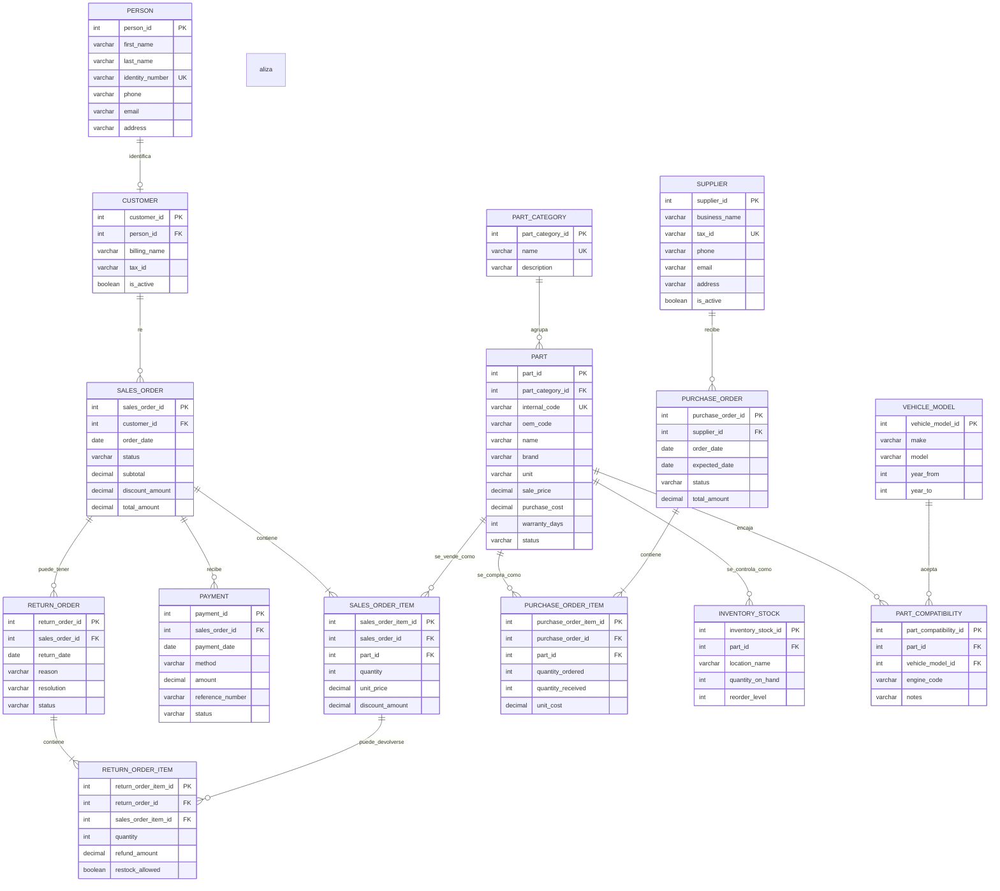

# Entity Relationship Diagram (ERD)

Este documento contiene un **ERD compacto** para Zarvent Repuestos, construido
desde los procesos documentados: clientes, catalogo de repuestos, inventario,
ventas, pagos, compras a proveedores y devoluciones.

El objetivo no es meter todas las tablas posibles. El objetivo es modelar el
nucleo del negocio sin duplicar informacion y dejando relaciones claras.

## Diagrama base

## Decisiones de diseno

- `PERSON` separa la identidad civil del rol comercial. Asi una persona puede
  existir primero como contacto y luego convertirse en `CUSTOMER` sin duplicar
  datos.
- `SALES_ORDER_ITEM` guarda `unit_price` historico. NO dependas del precio
  actual de `PART` para reconstruir ventas pasadas.
- `PURCHASE_ORDER_ITEM` guarda `unit_cost` historico para comparar costos de
  proveedor y margen.
- `PART_COMPATIBILITY` resuelve la relacion muchos-a-muchos entre repuestos y
  vehiculos. Sin esta tabla, vas a terminar duplicando descripciones a mano.
- `INVENTORY_STOCK` mantiene el stock actual por repuesto y ubicacion. Los
  movimientos detallados pueden agregarse como extension cuando el diseno base
  ya este estable.

## Alcance no incluido en este ERD compacto

Para mantener el modelo corto, quedan fuera del diagrama principal:

- usuarios, roles y permisos
- comprobantes/facturas con detalle tributario
- movimientos historicos de inventario
- marcas y modelos de vehiculo normalizados en tablas separadas
- reportes, porque los reportes se consultan desde las tablas operativas
